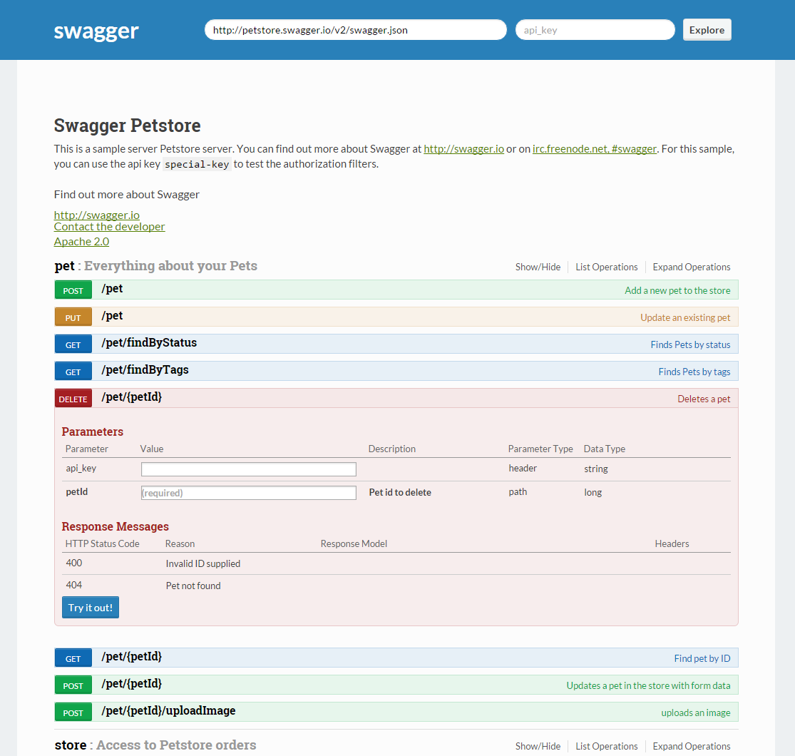

## ReadTheDocs Theme for Swagger UI
---
*Version 0.0.2*

A ReadTheDocs theme for Swagger UI.



You can find the Swagger UI project on GitHub [here](https://github.com/swagger-api/swagger-ui).

## Getting started

Download the swagger-ui-theme-rtd project and place the desired stylesheet into the source of your swagger-ui html.

In the `<head>` of your html, reference the location to your [theme].css. Make sure to load the theme after `screen.css` to override the default Swagger UI styles.

```html
<head>
    ...after screen.css...
    <link href="https://fonts.googleapis.com/css?family=Lato:400,700|Roboto+Slab:400,700|Inconsolata:400,700" rel="stylesheet" type="text/css">
    <link href='path/to/theme-rtd.min.css' media='screen' rel='stylesheet' type='text/css' />
    ...
</head>
```
#### Install with Bower

```shell
$ bower install swagger-ui-theme-rtd
```

## Contributing

If you want to add theme ideas or other fixes/changes to how the package works, feel free to submit an issue.

## License

- Code licensed under [MIT License](https://github.com/petervandenhout/swagger-ui-themes/LICENSE)
